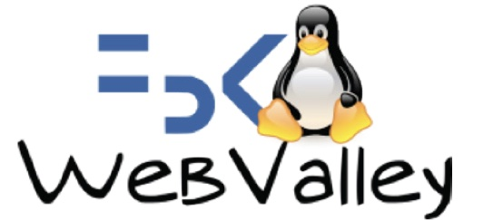

🇬🇧 Welcome to [WebValley](https://webvalley.fbk.eu) Python Programming Class! The class is meant for absolute beginners and code practictioners who are willing to move their first steps into with the [Python](https://python.org) programming language.
## Table of Content

- [About the workshop](#descr-eng)
- [Credits](#credits)
- [License](#license)

### <a name="descr-eng">About 🇬🇧</a>

During the workshop, we will design an innovative **Pokémon** [Search Engine](https://en.wikipedia.org/wiki/Search_engine).

This engine will feature a special and super secret technology that is capable of retrieving the `k` most similar Pokémons with respect to the [_search query_](https://en.wikipedia.org/wiki/Information_retrieval).

We will design and implement _step-by-step_ this core technology in order to calculate the similarities between any pair of Pokémons, either existing or _imaginary_ ones, as identified by a specified set of characteristics.

🧑‍💻 **Happy coding!** 👩‍💻

#### Curious to know more? (⚠️ SPOILER ALERT)

We will be working on our implementation of the [KNN](https://en.wikipedia.org/wiki/K-nearest_neighbors), a very popular and simple [Machine learning](https://en.wikipedia.org/wiki/Machine_learning) algorithm designed to measure the distances between points in N-dimensional spaces.

Each `Pokémon` in our dataset will be denoted by the following set of _features_:

```
* HP (hit points)
* Attack
* Defense
* Special attack
* Special defense
* Speed
```

The goal of the algorithm is to compare the values of each of those characteristics, and return the `k` _most similar_ pokémons (i.e. the ones at closest distance) given
an input search query.

#### Tools

We won't be using any external libraries or software. Everything will be implemented in pure Python, using all the _batteries already included_ in the language stack.

The development environment used throughout the workshop will be [Jupyter](https://jupyter.org).

[↑ Back to top](#table-of-content)

### CREDITS

- [Valerio Maggio](https://github.com/leriomaggio), Senior Research Associate at University of Bristol, and Software Sustainability Fellow

This material has been adapted from the [PyCon 22 Beginners' Workshop](https://pycon.it/en/beginners-day) available on this [repository](http://github.com/pythonitalia/pycon-beginners-day)

[↑ Back to top](#table-of-content)

### LICENSE

All the **Code** material is distributed under the terms of the MIT License. See [LICENSE](./LICENSE) file for additional details.

All the instructional materials in this repository are free to use, and made available under the [Creative Commons Attribution
license](https://creativecommons.org/licenses/by/4.0/).

[↑ Back to top](#table-of-content)